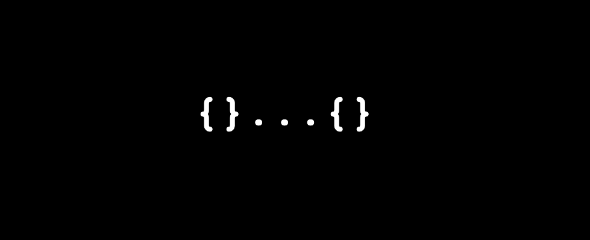

# Spread.js Server



## Get started

Install:

```shell
npm i spreadjs-server
```

## Usage

In order to sync your local data structure, spin up the built-in socket server. The internal communication is done via web sockets.

### Start the socket server

```shell
node index.js
```

### Use the client

Install:

```shell
npm i spreadjs-client
```

 or

```html
<script src="https://cdn.jsdelivr.net/gh/spreadjs/spread/spread-browser.js" />
```

```javascript
// Initialize. All instances share the same websocket connection
let store = new Store('ws://your_server');

// Set any properties on the storage object
store.config = {};
store.config.name = "Peter";
store.config.array = ["one"];
store.config.array.push("two");

// Delete properties
delete store.config.array;

```